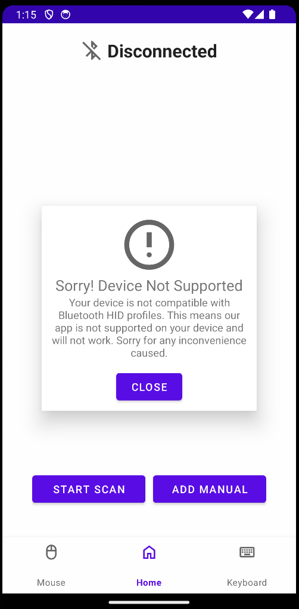
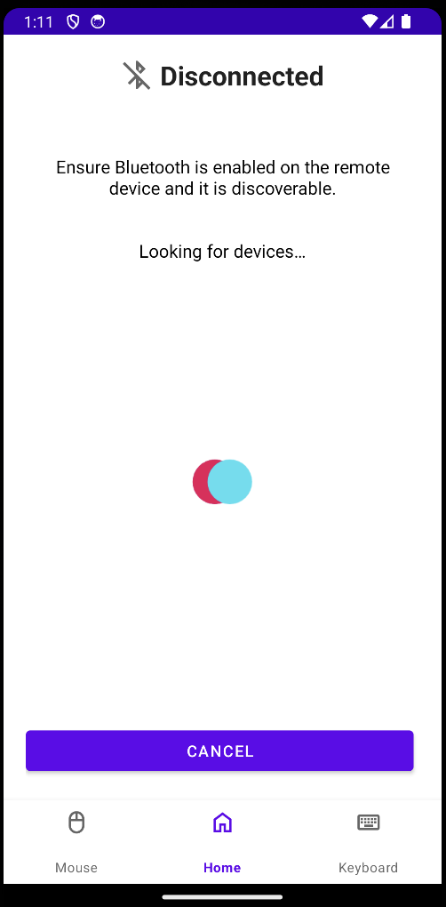

## Continued App Improvements

Moving into december, we started the month by improving resiliency and code quality of what we currently had implemented. We also made UI changes, adding information to pages to inform the user on how to use the app. Finally, we finished with adding Bluetooth scan functionanily to enable the app to search for nearby devices the user may want to connect to.

### 1. Added Not Supported Pop Up

Not all Android devices support Bluetooth HID. We have added a check when the app starts which will check that the users device does infact support Bluetooth HID. If the devices doesn't support HID then a popup page will be lannched to inform the user that their device is not compatible. This also then disables the main functions of the app to stop the user for using the app further.

  

### 2. Added Bluetooth Scan for Nearby Connections

We have add a new page that performs a Bluetooth scan for nearby available devices. The scan is triggered by a button on the main bluetooth page and will start a scan for nearby devices that are available to connect to. The result of this scan is displayed as a list of devices on the screen, including the found device name and MAC address. Then in the same way that the user can connect to a paired device, they can click the item in the list of found items to add it to the devices paired items.

  

### 3. Improved the UI - Added Text on the Bluetooth Page to Help User and Give Instructions

This includes simple UI improvements. We have added instructions and text boxes around the apps UI to provide instruction and information about how the user can use and interact with the app. This is a minor update but improves the usability of the overall app and user experience.

### 4. Stop Adding of Duplicate Devices

We added a simple check to stop users from adding devices with the same MAC address mutliple times.
