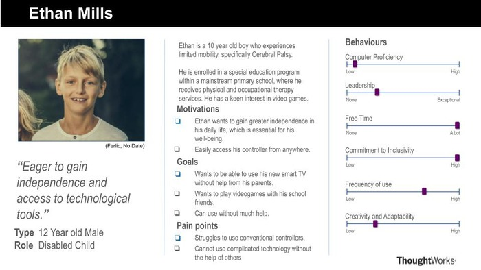
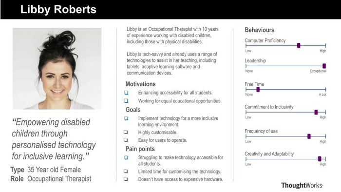

# Requiements

## Project Background

MotionInput is a project lead by UCL that has spanned over multiple years of development. It aims to transform everyday computer web-cams into virtual a controller for your computer using a range of inputs, such as: Face tracking, Eye tracking, Hotspot tracking and Movement tracking.

MotionInput Bluetooth Controller aims to bring this technology to android as a standalone controller. This will allow users to connect the controller to any device that is Bluetooth controllable and control it using MotionInput technology.

The controller should be accessible to users with a wide range of ability and also work with a range of devices, such as: Mac computers, iPad's, Windows computers, Smart TV's and other Android devices.

## Project Goals

Our aim is to develop an app that can be downloaded directly from the Android app store and run on a wide range of Android devices.

The controller will connect to devices over bluetooth and should work without having to install any further software on the connected device.

The app will allow the user to control the mouse and keyboard on their devices and will also have the ability to act as a joystick controller for games devices.

## Gathering Requirements

We conducted a series of semi-structure interviews on potential users of the controller to find the specific needs of our users.

### Interview 1 - Occupational Therapist

**Question**: What would you envision for the mobile bluetooth controller?
**Answer**: I would like a mobile app for android which can connect to a range of devices and use Motion Input controls to use that device.

**Question**: Have you tried conventional gaming controls? Do they work with people who have disabilities?
**Answer**: Yes, I have tried other adapted controls, such as Cephable (Cephable, N.D.),  but they don’t have support on all my devices such as smart TVs that I use in my classroom.

**Question**: How would you use the controller?
**Answer**: I would use the controller in my classroom to play interactive games in which all children can be involved.

**Question**: What specific features would you need?
**Answer**: The controller needs to have different modes of input to include people with a range of disabilities and be easily setup.

### Interview 2 - Parent of a Disabled Child

**Question**: What would you envision for the mobile bluetooth controller?
**Answer**: A controller for a mobile phone or tablet that is simple and easy to connect. I should be able to control things like the keyboard keys, the mouse and even a joypad using motion controls that are easily toggled on and off.

**Question**: Have you tried conventional gaming controls? Do they work with people who have disabilities?
**Answer**: Yes, I have tried to play with my friends, but I couldn’t use the controller.

**Question**: How would you use the controller?
**Answer**: I want to be able to play video games without having to hold a physical controller.

**Question**: What specific features would you need?
**Answer**: I am unable to press buttons on a controller for my smart TV. I would like to be able to connect the controller to my TV and use arm movements and gestures to control it.

## Personas

Using the data collected, we created personas and scenarios for our target users.

  

  

## Use Cases

The diagram below highlights how the users can interact with the final product.

## MoSCoW Requirements List