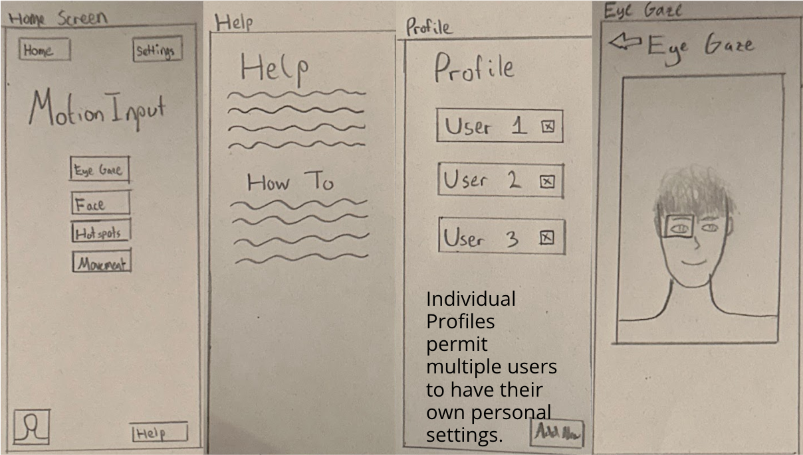
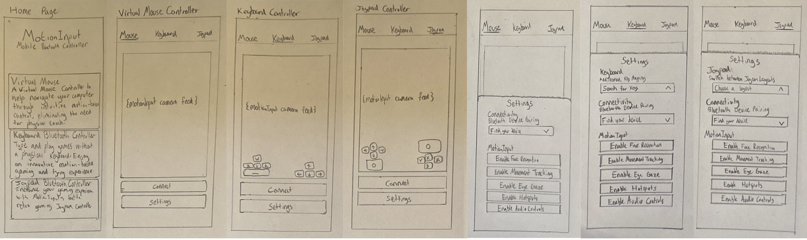
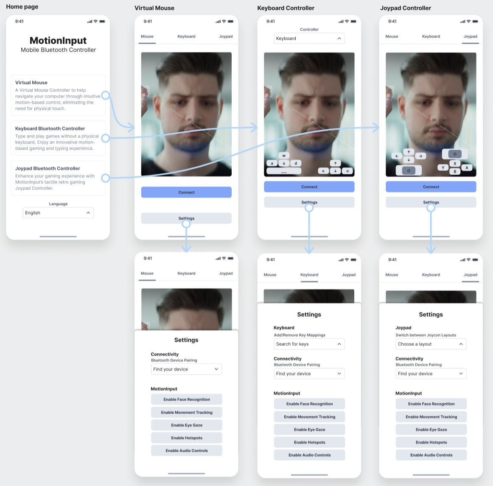

## HCI Presentation Blog

Welcome back to our Systems Engineering (COMP0016) project blog! In this installment, we will delve into the exciting world of Human-Computer Interaction (HCI) as we share our journey from understanding user needs to building and refining our motion input Bluetooth controller prototype.

## Personas and Scenarios

Armed with valuable insights from user surveys and interviews, we set out to create personas and scenarios that would guide the design and development of our MotionInput Bluetooth Controller. Personas help us empathise with our users, and scenarios provide a narrative context for how our product fits into their lives.

## Prototypes and Wireframes

With our personas and scenarios in mind, we embarked on the exciting phase of sketching multiple possible prototypes. These sketches explored different design ideas and interaction patterns, ensuring that we considered various user preferences.

The most promising sketches were then translated into a digital wireframe prototype using Figma. Figma allowed us to create a clickable prototype that simulated the user journey through our motion input controller app.

## Prototype Evaluation and Refinement

To ensure the usability and effectiveness of our prototype, we conducted a rigorous evaluation based on HCI principles. We identified potential issues and areas for improvement, addressing each problem systematically:

| Problem Number | Location & Description | Heuristic | Solution | Severity |
| --- | --- | --- | --- | --- |
| 1 | Disabled users misclick connect and settings buttons | Flexibility and efficiency of use | Move buttons further apart | 3 |
| 2 | Awkward drop-down menu for controller switching | Aesthetic and minimalist design | Implement a minimal toolbar for controller selection | 1 |
| 3 | Unclear status of MotionInput settings | Consistency and standards | Add a visual indicator for MotionInput options | 2 |
| 4 | Lack of language options | Speak the user's language | Include language selection on the home page | 1 |

We have taken this valuable feedback to heart, making iterative improvements to our prototype. The user experience is our top priority, and these refinements bring us one step closer to delivering a good final product.
