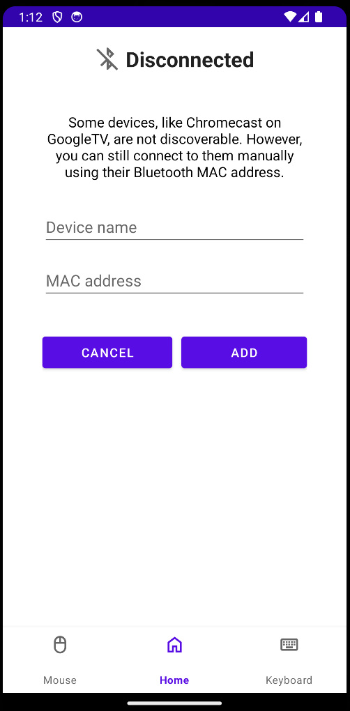

## Beginning to Write Code

Now that our project research was complete and we had a clear plan and roadmap of what we wanted to achieve we could begin writing code. Starting off, we created a blank project in Android Studio using Gradle and our chosen language Java.

### 1. Created a Vitual Mouse Interface

We needed to design a mouse interface within the controller that the user would use from within the app. We then went onto implement a joystick that the user could press and move on the app screen to input X and Y mouse movements and two buttons on the screen for left and right click. This simple but effective interface gives full control over mouse input from within the app.

  

### 2. Added HID Device Support For Mouse

Added the required functionality to make a bluetooth connection using the HID protocol using Androids native libraires.

First we defined a 'BluetoothMain' class that is instantiated on app start. This contains all the high-level methods needed by the different app components to create bluetooth connections and send data. This initialises a bluetooth adapter which checks whther the devices supports the required Bluetooth profiles and also whether Bluetooth is enabled on the device. It then initialises this using the BLUETOOTH_HID profile to allow us to use the bluetooth HID protocol.

Once everything has been initialised the Bluetooth Main class provides methods to connect to a given Bluetooth MAC address and also send data packets.

Finally we had to define our own Bluetooth HID descriptor. This took a lot of research to find the correct packet formatting we needed to use. Once we understood what was required we then defined out descriptor to use 3 bytes. The first byte was used for the click buttons, each button uses one bit of space therefore we designated 3 bits for the left, middle and right clicks and the other 5 bits were reserved for padding. The second and third bytes designate a 16-bit signed integer that would give the integer range -127 to 128. This would be used for the relative X and Y position of the mouse.

### 3. Added Manual Connection Via Bluetooth MAC Address

We have added functionality to manually add devices to the app by entering the target devices MAC address. This includes all the UI and backend functionality necessary.

The UI now has an 'Add Manual' button which when pressed takes you to the new page to add devices. This new pages contains two buttons, 'Cancel' which takes you back to the main page and 'Add' to submit the new device. There are also two input fields 'Name' and 'MAC Address' where the user can enter the MAC address and the name identifier of their chosen device.

The UI also includes error handling. It will only allow the user to submit a valid MAC address of the format 'XX:XX:XX:XX:XX:XX' and will display error messages on the screen if the user enters something otherwise. It will also not allow the user to submit a empty field and will also display the respective error message in this case.

Once the user submits a new device it will be commited to the apps device storage and saved for future usage.

  

### 4. Tested Sucessfully on Ipad and Mac

We were able to connect to Mac and IPad devices using the 'Manual Connect' feature and control their respective cursors using our apps JoyStick interface. This included successful usage of X and Y movement and both left and right click.
