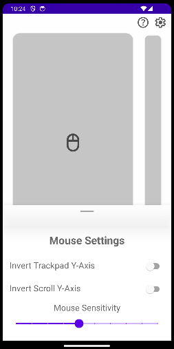

## Continuing Development

For the remaining part of January we continued with app development. First we added settings to the app to add configurability so users could tailor to best fit their needs.

### App Settings

Adding user settings to make the application more customisable such that cursor could taylor it better for their specific needs was a top priority.

Starting off we added a settings icon in the top-right corner of the screen which would be used to open the settings page. When the button was pressed the settings page would slide up from the bottom of the screen - displaying all the options. Then to go back the user could drag it away by swiping down or by pressing anywhere on the screen other than on the settings popup.

In the backend, we use a singleton settings class to deal with getting and setting all the settings variables for the app. It uses Android **Shared Preferences** to save the current setting states to the devices storage. The class then provides getter and setter methods to retrieve the current state or update a value.

We decided to have seperate settings pages for each component to keep everything organised. These will still accessed by the same button but a different settings page would be displayed depending on which component the user was using - for example, if the user was on the mouse page the mouse settings page would be displayed:

  

