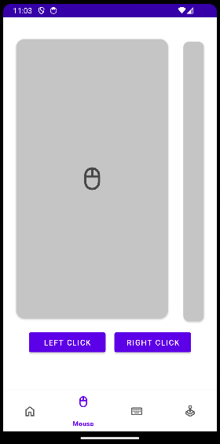
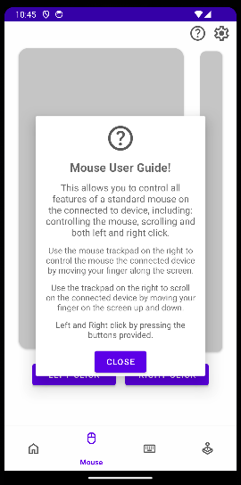

## Start of a New Year

After the Christmas break and the start of a New Year we got back into development. Starting off in January we made the decision to change the user interface for our mouse. It was decided instead of using a Joystick we would use a Trackpad. We then added two new features: information popups and app settings.

### Trackpad Implementation

We decided to switch to a Trackpad instead of a Joystick because it was generally much easier to use and control, especially when trying to make fine mouse movements. To start off with implementation of this we declared a rectangular region of the UI that would be our trackpad. Then in the backend of our apps code we created a listener that would look for when the user presses on the screen inside of the trackpad region. From this we got an (x,y) coordinate and then using the previous (x,y) we could calculate a delta movement, therefore translating the users gesture into mouse movement.

We then added a smaller trackpad bar to the right which would only look at user gestures in the y-axis and would allow the user to scroll the page on their screen.

  

### Instruction Popups

To each page we have also added instruction and information popups. These are accessed similarly to the settings page, by pressing an icon placed on the top-right of the screen. Then depending on what component the user is viewing the corresponding instruction popup will be displayed. We have added instruction pages that cover how to pair new Bluetooth devices and how to use the mouse, keyboard and game pad features. For example, if they are using the mouse component the mouse instructions will be displayed:

  

