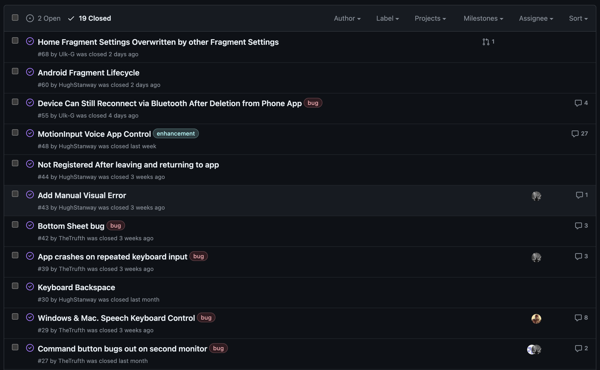
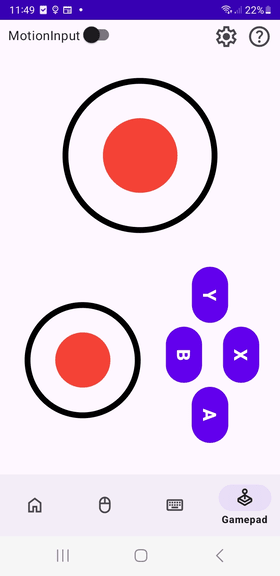

## Further Development

Begining the month of february we begun to work on bug fixes and issues within the app with the goal of getting the app deployment ready. We started getting ready for MotionInput integration.

### Bug Fixes

We continued consistiently testing our app throughout the development process and using GitHub issues to track the fixing process. During over the past few weeks we have placed a larger emphasis on dealing with existing known bugs within the app.

  

### Fixing the Permissions Check

When testing of different phone models and versions of Andoid we noticed that the Bluetooth connectivity was not working correctly and sometimes even causing the app to crash. After further investigation we deduced that the issue was within the permissions check component. Finally, after some more testing and reseach we we're able to issue an update to the component that fixed the problem.

### Getting Ready for MotionInput Integration

With the masters students working on MotionInput for Andorid getting close a working prototype we started getting ready to integrate their work into our app. This started by meeting with the other team to discuss integration options and how each of the respective code bases worked. Once we decided on a plaan we begun with getting our app ready. This started by adding a MotionInput switch to the top bar of the app which when toggled 'on' it would activate MotionInput mode whereas when switched off it would remain in manual control mode. When in MotionInput mode the manual screens for each of the components will be replaced with the MotionInput version of this screen. By default this includes a drop-down menu we added which allows the user to select the version of MotionInput they want to use: Face, Hands or Eyes.

After this was complete and working the other team begin to integrate their code into each MotionInput fragment we creared.

## Adding the Gamepad

We finally finsihed implemented the last controller, the gamepad, this week. The gamepad HID protocol is a lot less supported than we expected, so we instead implemented the gamepad using a combination of the mouse and keyboard protocols. By using them at the same time, we get the same final product as a gamepad protocol would, but with more support. 

  

Here is the UI of the gamepad. By default there are 4 buttons and two joypads, and it is configured to be used with Minecraft. The left joycon is mapped to WASD and the right moves the camera around, just like how an XBox controller works. Similarly, the ABXY buttons are mapped to left-click, right-click, space, and e (for inventory). If users want to play other games, they can configure the gamepad using presets in the settings menu. These can easily be added for different games and change the functionality of the buttons and the joysticks.

### Bug fixes

One bug which was giving us considerable trouble is press and hold for the ABXY buttons. This was due to misusing the combination of the hid protocols, and took us a considerable amount of time to fix. It was necessary to do though because gamepad is improved massively after these changes.

### Accessibility Benefits
The addition of gamepad support further enhances the accessibility of our application, making it more inclusive for users with mobility impairments or those who find traditional touchscreen controls challenging. By offering alternative input methods, we're striving to ensure that our app is accessible to all users, regardless of their abilities.

### Future Developments
Currently, the user has no way of adding more buttons to the gamepad or moving the button layout around. This would be helpful for users if they need to have buttons in specific places for accessibility reasons or if a game requires more buttons. 

