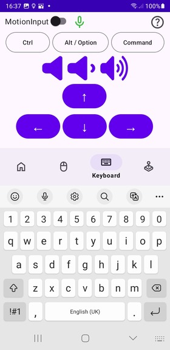

## Introducing the Bluetooth Keyboard

Ending this month we added a fully functioning bluetooth keyboard onto the app. It took a while to get the combined mouse and keyboard HID descriptor working, but we finally got it functioning!

### The Keyboard Fragment: Seamless Integration

Our latest update includes the integration of a keyboard fragment within the app. When you navigate to the keyboard section, it automatically focuses and brings up a soft keyboard. This allows for an intuitive and familiar typing experience, similar to standard mobile device keyboards.

#### Key Features of the Keyboard Fragment:
- **Automatic Focus**: The keyboard opens and focuses immediately, ensuring a smooth transition for the user.
- **Soft Keyboard Implementation**: A soft keyboard is displayed, offering a comfortable and efficient typing experience.
- **Multiline Editing**: Supports multiline text editing, catering to various text input needs. Including deleting text, and creating line spaces via the enter key.

### Behind the Scenes: Development Insights

The development of this feature involved several technical considerations:

- **Fragment Implementation**: The keyboard is implemented as a fragment within the app, allowing for easy access and integration with other features.
- **Hiding the Text Box**: To maintain a clean and uncluttered interface, we chose to hide the textbox on the app while ensuring the keyboard remains responsive to user input on the target device.
- **Bluetooth HID Protocol**: Each keystroke is captured and sent via the Bluetooth HID protocol to the target device. This ensures real-time text input and response.

  

