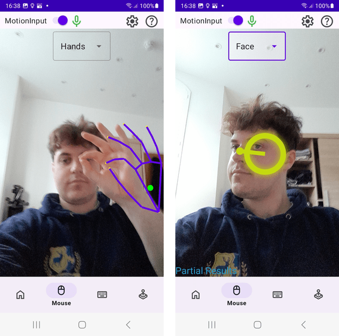

## Integrating MotionInput and Final testing

Starting the month we worked closely with the masters and the final year students to merge their MotionInput builds into our app. Next, although we had ensured to follow test-driven-development throughout the entire development process, as we neared a final product, we started increased testing of the app. This invloved writing UI tests, Instrumented (Unit) tests, Integration tests and Performance testing.

### Finished MotionInput Integration

After we added the foundeations for integration MotionInput at the end of last month, the merging of MotionInput builds was done at the start of this month. This was successfull as we worked with the other teams to fix any bugs that was introduced along the process and we now have MotionInput integrated into the app.

  

### Writing Tests

#### Instumented (Unit) Tests

Instrumented tests are small unit-like tests that test small components of each class induidually in isolation to other components of the app. These are written similarly to unit tests, however, they differ in the fact that they run on physical or emulated Android devices rather than the JVM therefore they can still use the Android framework. This is crucial for testing UI components and Bluetooth components of the app. Using a combination of testing libraries and frameworks, such as JUnit, Espresso, Mockito and others, we began writing extensive tests that would interact with the apps UI and backend componets to test they were behaving correctly for both valid and invalid input.

#### Integration Tests

We used integration tests to test how entire components behaved as a whole. This was mainly done with the Bluetooth component as we tested how it's classes worked together as an entire component and how it interacted with Androids bluetooth librares.

#### Performance Tests

We used the Android Studio profiler to measure the CPU and memory activities of the app during general use. This allowed us to measure average performance over time but also check for any bottlenecks in performance.
