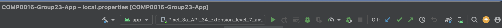

# Deployment Manual

MotionInput Bluetooth controller has been built in Android Studio and written in Java. You will need an android device running AndroidOS Minimim 11 to install the controller on your device or alternitively you can use the built in Android Studio emulator.

**Note: The Andoid Studio emulator doesn't have any Bluetooth or Camera functionailty, therefore the main features of the app are limited to physical devices.**

## Prerequisites

- Git
- Android Studio (Minimum Version Required: Iguana)
- Java Development Kit (JDK)
- Android SDK (This is usually installed alongside Android Studio)
- Gradle (This is usally installed alongside Android Studio)

## Configure the Repository

Clone the repository to your machine:

```
git clone https://github.com/MotionInput/MotionInput-Bluetooth-Controller.git
```

In Android Studio, open the cloned repository as a project. Then under Gradle scripts select the ```local.properties``` file and modify ```sdk.dir``` to be the path to your local install of the Anroid SDK. This might look something like ```/Users/your_name/Library/Android/sdk```. This may already be configured already - if so you don't need to change anything.

You might also need to specify the JDK version gradle will use to build the project:

On Mac:

```
Android Studio > Preferences (Settings) > Build, Execution, Deployment > Build Tools > Gradle > Gradle JDK
```

On Windows:

```
File > Settings... > Build, Execution, Deployment > Build Tools > Gradle
```

Finally you need to ensure Android Studio is setup using the correct Gradle plugin version and Gradle Version. First go to:

```
File > Project Structure
```

Then, ensure:

```
Gradle version: 8.4
Gradle plugin version: 8.3.0
```

Now check if everything is setup correctly:

```
File > Sync Project with Gradle Files
Build > Rebuild Project
```

After a successfull Gradle Sync Android Studio is setup and ready to run.

## Setup Android Device (Only if not using Emulator)

You need to put your Android Device in developer mode in order to build apps directly from Android Studio.

1. On your device, find the Build number option. The following table shows the settings location of the Build number on various devices:

| Device | Setting |
| --- | --- |
| Google Pixel | Settings > About phone > Build number |
| Samsung Galaxy S8 and later | Settings > About phone > Software information > Build number |
| LG G6 and later | Settings > About phone > Software info > Build number |
| HTC U11 and later | Settings > About > Software information > More > Build number or Settings > System > About phone > Software information > More > Build number |
| OnePlus 5T and later | Settings > About phone > Build number |

2. Tap the Build Number option seven times until you see the message ```You are now a developer!``` This enables developer options on your device.
3. Return to the previous screen to find Developer options at the bottom.

Before you can use the debugger and other tools, you need to enable USB debugging, which allows Android Studio and other SDK tools to recognize your device when connected via USB.

Enable USB debugging in the device system settings under Developer options. You can find this option for Android 9 (API level 28) and higher: 

```
Settings > System > Advanced > Developer Options > USB debugging
```

The final set is to connect your device to your machine using any USB cable. Then accept any permissions that are asked during this process.

## Build App onto your Device

On the top navigation bar in Andorid Studio ensure the name of the your connected devices matches the device name displayed on the toolbar. For example, the image below shows the device name ```Pixel_3a_API_34_extension_level_7_arm64-v8a``` but this will change depending on your device.

Finally, click the green arrow to the right of this box to build, install and launch the app on your device.

<div class="img-center">  </div>

## Install Directly from APK via USB

1. Make sure USB debugging is enabled by following the steps above
2. Plug your phone into your computer with a USB cable, and it'll recognise the phone like it would a memory stick.
3. Your phone will show up as another drive in File Explorer.
4. Move the APK file you downloaded into the appropriate folder on your phone, which might be called Download or /sdcard/download, or an equivalent.
5. Once the file is transferred, use a file explorer app on your phone to tap the APK file and install the app.