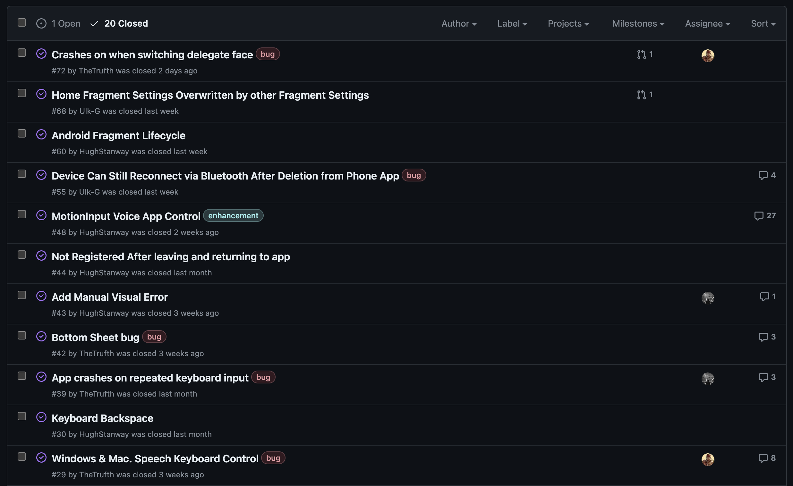

import Tabs from '@theme/Tabs';
import TabItem from '@theme/TabItem';

# Evaluation

---

## MoSCoW List Evaluation

### Functional Requirements

We a pleased that our product completes 100% of the MUST and SHOULD and some of the COULD MoSCoW requirements. The full achievement table is shown below:

| ID | Requirement | Priority | Completed | Contributors |
|--|--|--|--|--|
| 1 | Android app that establishes Bluetooth connections with Smart TV, computer of tablet | Must | &#10003; | Hugh, Ulk, Robbie |
| 2 | Bluetooth connection should not require additional software | Must | &#10003; | Hugh, Ulk, Robbie |
| 3 | Mouse controller | Must | &#10003; | Hugh |
| 4 | Keyboard controller | Must | &#10003; | Ulk |
| 5 | Gamepad controller | Must | &#10003; | Robbie |
| 6 | MotionInput support and integration for Face, Hands and Eyegaze | Must | &#10003; | Hugh + Masters Team's |
| 7 | Settings pages | Must | &#10003; | Hugh, Robbie |
| 8 | Dark and light Mode | Should | &#10003; | Hugh |
| 9 | Speech input to control app navigation | Should | &#10003; | Hugh + Masters Teams's |
| 10 | Speech controlled keyboard over Bluetooth | Should | &#10003; | Ulk + Masters Team's |
| 11 | Auto Bluetooth reconnect setting | Could | &#10003; | Hugh |
| 12 | Make the device discoverable to connect from other devices | Could | &#10007; | N/A |
| 13 | Ability to add and remove key-binds for MotionInput mode in settings | Could | &#10007; | N/A |
| 14 | Profiles to retain settings and presets for each user | Wont | &#10007; | N/A |

## Known Bug List

Our team used the GitHub issues page as the main way of tracking and fixing known bugs within our app. Over the development process we identified 21 different bugs and issues which were all sunsiquently reported and tracked on GitHub. We are pleased to say that as of finishing the project we issued fixes for all known bugs and the only outstanding issue is for extending support to older versions of Android.

| ID | Known Bug | Priority|
|--|--|--|
| 1 | No support for Android versions 10 and below. #16 | Low | 

  

  

## Induvidual Contributions

| Work Packages        | Hugh | Robbie | Ulk |
|-------------------------|--|--|--|
| Project Partner Liaison |     |    |    |
| Other Teams Liaison     |     |    |    |
| Requirement Analysis    |     |    |    |
| HCI                     |     |    |    |
| Research & Experiments  |     |    |    |
| UI Design               |     |    |    |
| Coding                  |     |    |    |
| Testing                 |     |    |    |
| Project Website         |     |    |    |
| Presentation Planning   |     |    |    |
| Video Editing           |     |    |    |
| **Main Roles**          |Client Liaison, Programmer, Tester |Report Editor, UI Designer, Researcher |Programmer, UI Designer, Tester|

## Critical Evaulation

<Tabs>
  <TabItem value="1" label="User Interface & Experience" default>
  During the project we always ensured our project would meet the requirements of the end user. We frequently tested in lab sessions with a broad range of different users to measure the success of our requirements. We adapoted a similar UI design to many mobile applications, using a single navigaton bar at the bottom of the screen in order to move between pages. We found that this gave familiarity to what users have experienced before, therefore, they were fast in learning the apps flow.

  Lots of work was undertaken to ensure the UI was responsive to users interactions. All buttons have custom press animations, the trackpad uses a dynamic finger tracker that follows the users movement on the screen and error messages are display in an informitive and descritive mannor that is useful for users.

  The colour theme used is also clean, consistient and well balanced so that it is easy on the users eyes, assessible and visually appealing for users.
  </TabItem>
  <TabItem value="2" label="Functionality" default>
  Our app provides full functionality for three seperate input types: Mouse, Keyboard and Gamepad. These modes deliver the same functionality as a standard mouse and keyboard for each of these input modes while also providing usful preset settings and modifiable key presets for each.

  The Bluetooth functionality is capable of discovering all nearby Bluetooth devices, making connections and sending user input over Bluetooth.
  </TabItem>
  <TabItem value="3" label="Stability" default>
  Throughout the project, our team executed a comprehensive testing protocol encompassing both automated and manual procedures. Our automated testing framework evaluated the stability of individual classes in real-time on an Android device through instrumented tests. We also generated a comprehensive code coverage report, indicative a high level of test coverage.

  Furthermore, substantial time was spent undertaking user testing conducted by both our team and potential end-users, ensuring the app's usability and stability. We are pleased to confirm that all significant bugs identified during testing have been addressed, instilling confidence in the stability of our application for deployment and release.
  </TabItem>
  <TabItem value="4" label="Efficiency" default>
  Efficiency is a critical aspect of any user application, as any inefficiencies can deter users from adopting the product. Our team conducted performance testing on the final build of the app using Android Studio's profiler, and we're pleased to says that we identified no bottlenecks while measuring both CPU and memory usage during a sustained usage test. Additionally, we have implemented the utilization of multiple threads, particularly in the Bluetooth transmission code, to enhance the efficiency of our application.
  </TabItem>
  <TabItem value="5" label="Compatability" default>
  During development we considered backwards compatibility to make sure our application can run on as many devices as possible. Due to the ever evolving Android frameworks for different Android versions that proved to be hard in places but we are happy to say our app is compatible with Android versions 11.0 and above. This coveres the majoriy of current Android devices in use today. Although, we would have hoped to extend support even further back we still consider this as a success.

  We had also intended to extend support to Chromebooks. However, due to a difficulty with access to Bluetooth HID profiles when running ChromeOS this was not possible. After a discussion with our project partner, Dean, we all agreed it was best to focus on the Android app support.
  </TabItem>
  <TabItem value="6" label="Maintainability" default>
  Throughout the project lifecycle, we maintained a commitment to adhering to best practices and producing clean, well-structured code. Every method and class is documented with JavaDoc comments, providing comprehensive explanations of parameters and functionality. Our directory structure is clearly organized, facilitating clarity and ease of navigation, with all components arranged in a logical and intuitive manner.

  Each class is dedicated to a distinct process, following encapsulation principles, enhancing modularity and maintainability. This concerted effort results in a codebase that is highly readable and accessible, allowing new developers to contribute to the project.
  </TabItem>
  <TabItem value="7" label="Project management" default>
  The project was effectively coordinated through weekly lab sessions where tasks were organized and distributed among team members. GitHub's integrated tools were employed for issue tracking and ensuring that only functional code was merged into the main branch via pull requests. A Gantt chart was utilized to establish a project timeline and meet deadlines, facilitating successful completion. Additionally, weekly meetings were held with our project partner to communicate progress and gather feedback.
  </TabItem>
</Tabs>

## Future Work

# this needs to be way longer.

If we had more time we would extend the project in the following ways:

1. Enhance the application's performance to ensure better operation across a wider range of devices, particularly those with lower specifications. This would involve further optimization through threading and simplification of certain components to reduce complexity, ultimately aiming for smoother functionality across all device levels.

2. Implement user profiles to enable multiple individuals to utilize the same device with personalized settings and presets. By saving configurations to individual profiles rather than the app itself, users can effortlessly switch between preferences, ensuring a better experience for each user.

3. Make the app discoverable to other devices to expand the supported set of ways users can pair with target devices. Since some devices can only pair via this method it will make the app accessible to larger amount of potential devices.

4. Extend layout configurations to support landscape mode, thereby improving the user experience, especially on Android tablets. This would involve creating dedicated layout pages for landscape orientation, ensuring optimal usability across different device types.

