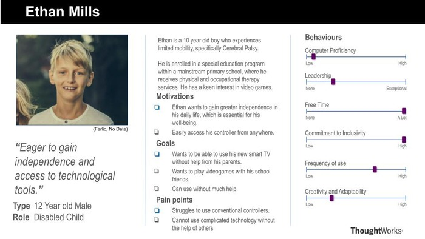
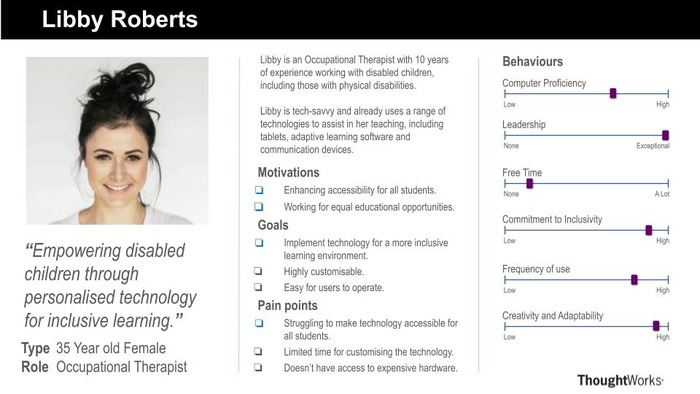
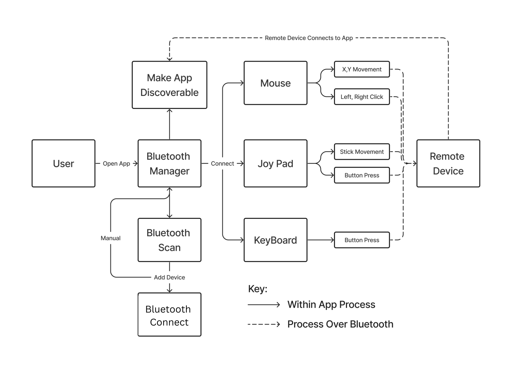

import Tabs from '@theme/Tabs';
import TabItem from '@theme/TabItem';

# Requirements

---

## Project Background

Accessibility to digital tools and devices is becoming increasingly crucial, and yet many individuals, particularly those with disabilities or confined to hospital settings, face significant challenges in harnessing the benefits of modern technology due to limitations in motor control. Simple activities like operating a TV can become arduous tasks for them, highlighting the pressing need for innovative solutions. MotionInput is a project lead by UCL that has spanned over multiple years of development with the goal of addressing this issue. It aims to transform everyday computer web-cams into virtual a controller for your computer using a range of inputs, such as: Face tracking, Eye tracking, Hotspot tracking and Movement tracking. 

Recognizing this, our team alongside our client MotionInput Games has been working to develop a solution that would empower users to get the full benefit of MotionInput through their phones rather than laptops. The MotionInput Bluetooth Controller for Android aims to offer an application that enables users to control a TV or any Bluetooth-enabled device hands-free from their mobile phone. It should support a variety of MotionInput input methods such as to allow users to navigate through interfaces, access entertainment, and engage with digital content with ease and comfort. The controller should be accessible to users with a wide range of ability and also work with a range of devices, such as: Mac computers, iPad's, Windows computers, Smart TV's and other Android devices.

## Project Goals

Our aim is to develop an app that can be downloaded directly from the Android app store and run on a wide range of Android devices. The app should have a full feature set displaying the vision of the Mobile Bluetooth Controller, and be easily extensible to support new MotionInput modes. That means we should support:

- Bluetooth Scan and Connection via the HID protocol.
- Manual Controllers, including a Mouse controller, Keyboard controller, and Gamepad controller
- MotionInput Integration with the Bluetooth Controller.

We hope that the development of this app will enable easier development of more MotionInput technology in the future, and also benefit individuals who need MotionInpt in their daily lives by making it significantly more convenient and accessible.

## Gathering Requirements

We conducted a series of semi-structured interviews on potential users of the controller to find the specific needs of our users.

<Tabs>
  <TabItem value="apple" label="Occupational Therapist" default>
    **Question**: What would you envision for the mobile bluetooth controller?  
    **Answer**: I would like a mobile app for android which can connect to a range of devices and use MotionInput controls to use that device. 

    **Question**: Have you tried conventional gaming controls? Do they work with people who have disabilities?  
    **Answer**: Yes, I have tried other adapted controls, such as Cephable (Cephable, N.D.),  but they don’t have support on all my devices such as smart TVs that I use in my classroom. 

    **Question**: How would you use the controller?  
    **Answer**: I would use the controller in my classroom to play interactive games in which all children can be involved.

    **Question**: What specific features would you need?  
    **Answer**: The controller needs to have different modes of input to include people with a range of disabilities and be easily setup.  
  </TabItem>
  <TabItem value="orange" label="Disabled Child">
    **Question**: What would you envision for the mobile bluetooth controller?  
    **Answer**: A controller for a mobile phone or tablet that is simple and easy to connect. I should be able to control things like the keyboard keys, the mouse and even a joypad using motion controls that are easily toggled on and off.  

    **Question**: Have you tried conventional gaming controls? Do they work with people who have disabilities?  
    **Answer**: Yes, I have tried to play with my friends, but I couldn’t use the controller.  

    **Question**: How would you use the controller?  
    **Answer**: I want to be able to play video games without having to hold a physical controller.  

    **Question**: What specific features would you need?  
    **Answer**: I am unable to press buttons on a controller for my smart TV. I would like to be able to connect the controller to my TV and use arm movements and gestures to control it.  
  </TabItem>
</Tabs>

## Personas

Using the data collected, we created personas and scenarios for our target users.

  

  

  

Based on the surveys and personas, these are the conclusions our team came to regarding requirements:

1. **Diverse Use Cases**: The surveys revealed a variety of use cases for the controller, ranging from controlling smart TVs in classrooms to enabling disabled individuals to play video games without physical controllers. This diversity underscores the importance of creating a versatile and adaptable solution that caters to a wide range of user needs and preferences.
2. **Documentation and Support**: As mentioned by the occupational therapist, comprehensive documentation and user guides are important aspects to assist users in setting up and using the controller effectively.
3. **Easy Connectivity**: The requirement for Bluetooth connectivity without the need for additional software installation on target devices highlights the importance of seamless and hassle-free connectivity. Users expect the controller to effortlessly connect to a variety of devices, enhancing convenience and usability.
4. **Customisability**: Various settings are important to cater towards all types of users with different needs. Accessibility features such as high contrast mode, dark mode, and customizable controls emerged as crucial requirements, alongside many different options for the MotionInput modes and tyypes. These features ensure that the controller is usable and accessible to individuals with diverse abilities and preferences.

Further conclusions are drawn in the MoSCoW lists at the bottom of the page.

## Use Cases

### Use Case Diagram

The use case diagram below highlights how the users can interact with the final product. Users will have access to three different bluetooth controller modes, including a mouse, keyboard, and gamepad. Each of these provides users with a new set of potential use cases, and widens the scope of our project's impact. The bluetooth connectivity and scan also play a key role in our apps usability.

  

###  Use Case List

A list of use cases for our app.

|**ID**|**Use case**|
|------|------------|
|UC1   | Pair and connect to the target device via Bluetooth scan. |
|UC2   | Pair and connect to the target device manually. |
|UC3   | Controlling the mouse movements and clicks on the target device over Bluetooth via the Mouse Controller. |
|UC4   | Type or input keybaord commands (e.g. volume up, CMD + Q) over Bluetooth via the Keyboard Controller. |
|UC5   | Play a game over Bluetooth via the Gamepad Controller. |

### Use Case Descriptions

||**Use case** |
|----- |-------|
|ID         | UC1 |
|Actor      | User |
|Description| Pair and connect to the target device via Bluetooth scan. |
|Main Flow  | 1. User opens the app and the system displays the home page.    2. User Clicks on the 'Start Scan' button.    3. The system scans for bluetooth devices in the area.    4. The user clicks on the target device from the list of devices.    5. The system initiates a pairing between the target device and the users device.    6. The user accepts the pop-up for pairing on both the user device and the target device.    7. The system connects the user device to the target device. |
|Result    | The user pairs and connects their user device with the target device. |

||**Use case** |
|----- |-------|
|ID         | UC2 |
|Actor      | User |
|Description| Pair and connect to the target device manually. |
|Main Flow  | 1. User opens the app and the system displays the home page.    2. The user clicks the 'Manual' button.    3. The user enters the MAC address of the device they are trying to connect to.    4. The system initiates a pairing between the target device and the users device.    5. The user accepts the pop-up for pairing on both the user device and the target device.    6. The system connects the user device to the target device. |
|Result    | The user pairs and connects their user device with the target device. |

||**Use case** |
|----- |-------|
|ID         | UC3 |
|Actor      | User |
|Description| Scanning via Bluetooth for target devices and pairing with the intended device. |
|Main Flow  | 1. User opens the app and the system displays the home page.    2. The user connects and pairs their device using UC1s or UC2s flow.    3. The user navigates to the Mouse page.    4. User sends inputs via the Trackpad UI on the screen.    5. The system sends the user inputs over bluetooth to the target device. |
|Result    | The user controls the target devices mouse inputs via Bluetooth on the user device. |

||**Use case** |
|----- |-------|
|ID         | UC4 |
|Actor      | User |
|Description| Type or input keybaord commands (e.g. volume up, CMD + Q) over Bluetooth via the Keyboard Controller. |
|Main Flow  | 1. User opens the app and the system displays the home page.    2. The user connects and pairs their device using UC1s or UC2s flow.    3. The user navigates to the keyboard page.    4. User sends inputs via the Keyboard UI on the screen.    5. The system sends the user inputs over bluetooth to the target device. |
|Result    | The user controls the target devices keyboard inputs via Bluetooth on the user device. |

||**Use case** |
|----- |-------|
|ID         | UC5 |
|Actor      | User |
|Description| Play a game over Bluetooth via the Gamepad Controller. |
|Main Flow  | 1. User opens the app and the system displays the home page.    2. The user connects and pairs their device using UC1s or UC2s flow.    3. The user navigates to the Gamepad page.    4. User sends inputs via the Gamepad UI on the screen.    5. The system sends the user inputs over bluetooth to the target device. |
|Result    | The user provides input to a game on the target device via Bluetooth on the user device. |

## MoSCoW Requirements List

### Functional Requirements List

This list outlines the essential features and functionalities expected in the development of our application. With a focus on accessibility and user customization, the app facilitates various control modes including keyboard, mouse, and joypad, and integration with MotionInput capabilities such as face, eye gaze, and hand movements. Users can toggle between controllers and customize key-binds to suit their preferences through an intuitive settings interface. While prioritizing accessibility with high contrast and dark mode options, the app also should offer potential enhancements like speech input support and automatic Bluetooth reconnection for added convenience.

  
Must Have

  

    

        - Android app which runs MotionInput and establishes a bluetooth connection with a Smart TV, Laptop, or Tablet in order to operate as a controller.
        - Bluetooth connection should not require any other software to be installed on the target device.
        - Controller types to be supported:
            - Keyboard controller (sends keyboard presses to device from local app)
            - Mouse controller (sends mouse movements and left / right clicks to device from local app)
            - Joypad controller (sends joypad inputs to device from local app)
        - MotionInput Controller types to be supported:
            - Face
            - Eye gaze
            - Hand Movements
        - Settings page to switch between controllers + the different types of MotionInput which the user uses (eye gaze, etc)
    

  

  
Should Have

  

    

        - Accessibility features:
            - Dark Mode
            - Light Mode
        - Speech input support to control navigation of the app and to change settings.
        - Bluetooth controlled speech input to type using the Keyboard.    
    

  

  
Could Have

  

    

    - Ability to add and remove new key-binds for MotionInput mode easily in the settings.
    - A setting to automatically reconnect to a bluetooth device after losing connection.
    - Make the device discoverable so the controller can be connected to from another devices.
    

  

  
Won't Have

  

    

    - Profiles such that users can retain which types of motion input they use without enabling it each time.
    

  

### Non-Functional Requirements List

Our project has a strong accessibility oriented focus, as an app targeted towards injured or disabled individuals. This means that the non-functional requirements that we prioritised consist of things like reliability and performance, making sure users have the smoothest experience using the app possible. We also hope that this app will continue to be developed and act as a base for all new technologies developed for MotionInput on Android in the coming years, being a relatively new project, and this also shows in our MoSCoW list with things like Scalability being a big priority of ours.

  
Must Have

  

    

        - Performance – The application must have fast response times to user inputs, enabling smooth interaction with connected devices.
        - Reliability - The app should maintain a stable Bluetooth connection with the target device, minimizing interruption during usage.
        - Compatibility - Ensure compatibility with a wide range of Android devices, encompassing various screen sizes, resolutions, and hardware specifications.
        - Scalability - The application architecture should support scalability to accommodate future updates without compromising performance or stability.
    

  

  
Should Have

  

    

        - Usability - Prioritize user-friendly interfaces and intuitive controls to enhance the overall user experience, catering to users of all abilities and preferences.
        - Documentation - Provide comprehensive documentation and user guides to assist users in setting up and using the app effectively.
    

  

  
Could Have

  

    

        - Internal Functionality - Implement functionality to enable users to interact with the android phone itself through MotionInput, rather than a connected bluetooth device.
        - Battery Efficiency - Optimize the app such that the power consumption is not excessively high, allowing for longer use of the application.
        - Feedback Mechanisms - Incorporate user surveys or in-app feedback forms to gather user input and improve the application based on user suggestions.
        - Localization - Support multiple languages in order to enable broader accessibility across different regions and communities.
    

  

  
Won't Have

  

    

        - Open Source - The project will not be open source as a part of the MotionInput organisation.
    

  

