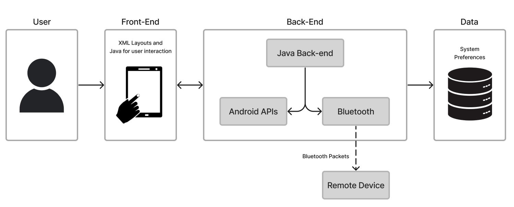
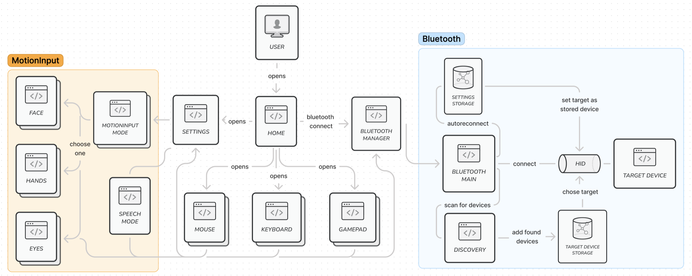
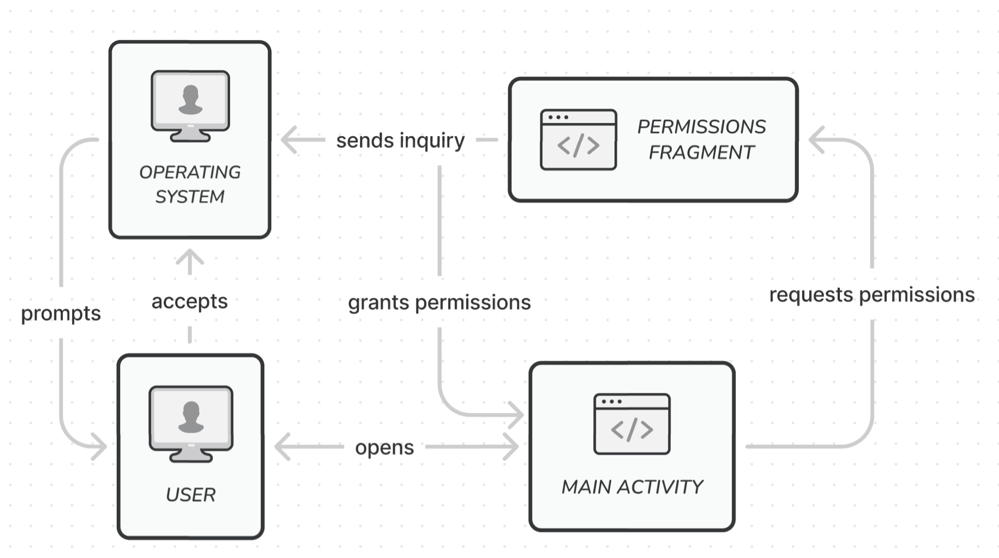
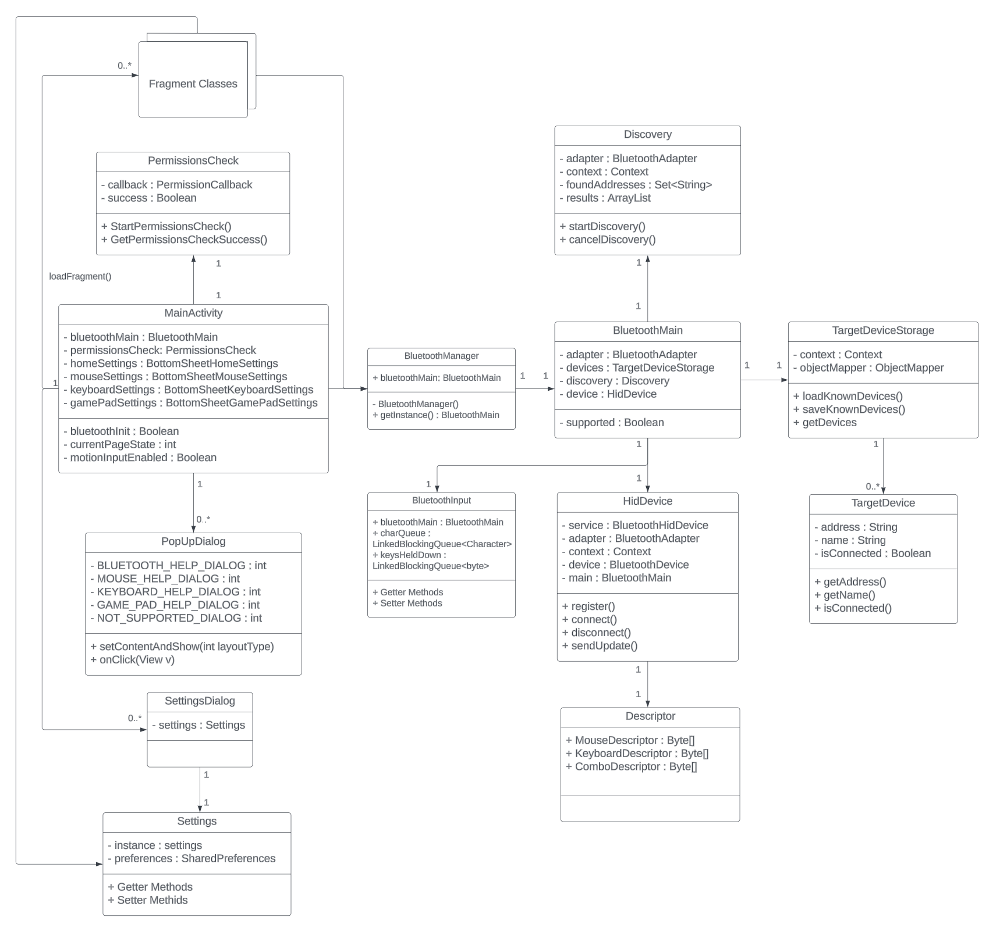

# System Design

---

## System Architecture

System Architecture Diagram

  

The MotionInput Bluetooth controller comprises both front-end and back-end components. The front-end components handle user interface presentation and user interactions within the application. The application is structured around a single activity, utilizing fragments as defined UI components and a fragment manager to dynamically switch between various UI displays based on user selections. XML layouts are employed in constructing the front-end to specify the structure and appearance of UI elements.

The back-end systems deal with the Bluetooth connection related logic and use Android APIs to deal with the interactions the user makes with the UI elements of the app. The back-end also communicates with the devices system preferences to save the users presets and local data.

  

The diagram above provides a more comprehensive overview of the system architecture for the MotionInput Bluetooth controller application. It illustrates the front-end components, including the various UI fragments for different functionalities like face, hands, eyes, mouse, keyboard, and gamepad. 

At a very high level, the back-end components related to Bluetooth connectivity are also shown, in an attempt to show the flow of operations for establishing Bluetooth connectivity with target devices. The Bluetooth section shows the flow of establishing a Bluetooth connection with a target device. The system will either reconnect to a stored device using autoreconnect or scan for new devices using the Discovery component, which adds found devices to the Target Device Storage. In reality, the system is significantly more complicated than this and there are many dependencies on different bluetooth components, but this abstracted view will help you understand what the program ends up doing.

The Bluetooth Main component is the central controller for Bluetooth operations, managing the connection process with the help of other components like Bluetooth Manager" and HID (Human Interface Device). The connection is facilitated through the "Bluetooth Manager" component, which utilizes the stored device information from the Target Device Storage. Our design emphasises separation of concerns between the front-end UI components, the back-end Bluetooth components, and MotionInput components.

  

A variety of permissions are needed from the user's operating system in order to use the app. These include bluetooth, location, and audio (for the speech feature) to name a few. This diagram shows how our application handles these permissions. Our application is structured around a single activity, so when the user opens the app, the main activity requests the necessary permissions through a dedicated permissions fragment. This fragment sends an inquiry to the operating system, which prompts the user to grant or deny the requested permissions. With the required permissions acquired, the main activity can then access the corresponding protected features of the application. This permission model ensures user privacy and control over what data and device capabilities an application can access, promoting transparency and security.

## Design Patterns

Here is a list of design patterns which we employed to make our application.

|Design Pattern| Use|
|--------------|-----|
|Singleton Pattern| The BluetoothManager class follows the Singleton design pattern, ensuring that only a single instance of the BluetoothMain class is created throughout the codebase. This pattern is useful when you need to control object creation and have a single, centralized point of access to an instance of a class.
|Observer Pattern|The Discovery class utilizes the Observer pattern to notify interested parties (e.g., UI fragments) when new Bluetooth devices are found during the scanning process. This pattern promotes loose coupling between the subject (Discovery) and observers (UI fragments).|
|Strategy Pattern| The various settings classes (GamePadSettings, MouseSettings, KeyboardSettings) implement different strategies for handling settings-related operations. This pattern allow the application to switch between different strategies at runtime, promoting flexibility and extensibility.|
|Template Method Pattern|Used for implementing each of the respective controllers (Mouse, Keyboard, and Gamepad), preventing the developers (us) from unnecessarily rewriting code.|
|Chain of Responsibility pattern| The bluetooth services is setup to process devices in using a chain of responsibility, allowing each bluetooth class to have a clear defined purpose.|

Design principles are also adhered to as much as possible. Each class has a clear singular purpose that is not repeated elsewhere in the code, adhering to the Single Responsibility Principle for better readability and extensibility. The use of many design patterns helps our code be more organised and modular through the Don’t Repeat Yourself Principle. We avoided code smells as much as possible, such as duplication, long methods, feature envy, and magic numbers. Many iterations were made through our project, such as reworking how all 3 controller classes input methods wokred, to avoid any anti-patterns, and as such the code has no god objects, spaghetti code, copy-paste programming, and singletons. 

## Design Goals

During the design and implementation process we used the following considerations:

|Design goal| Actions to take|
|--------|---|
|**Ease of Use**| - The user-interface should be simple and easy to use.   - Flow between different components of the UI should be easy to navigate.   - The features of the app must be intuitive and easy to learn.   - Each component of the app should have an information section which provides how-to-use insturctions to the user. |
|**Modularity**| - Different components of the app, e.g. mouse or keyboard, must be modular and seperate from one another.   - This means new app components can be added easily by future developers.   - Components which share common features, such as information dialog's, must implement a way to share them between each other while minimising duplicate code. |
|**Extendability**| - New components and UI features should be easy to add and implement.   - Extending the functionality of existing components should be intuitive for new developers. |
|**Consistiency**| - UI elements of the app should be consistient throughout different components.   - Coding conventions should be followed throughout the entire codebase to increase readability for future developers. |

## Backend Architecture

### High-Level Overview

The back-end of MotionInput Bluetooth controller is comprised of many components which are designed to deal with different aspects of the app functionality. We used an Object-Oriented approach to ensure modilarity between these components. This was essential as many of these componets dealt with completly different tasks to each other therefore by seperate and modular the readibility of the backend code-base was mainitained at a high level, even as the size of the app grew.

We firstly have a MainActivity class which serves as the entry point of the application and is main class in control of the lifecycle of the application. It is used to initialise and control all other classes of the application on boot and deals with deals with inflating UI resources by hosting them in a container.

Outside of MainActivity, the other classes can be grouped together into 4 general types:

| Type | Description |
| --- | --- |
| Bluetooth | These set of classes contain all of the logic for dealing with Bluetooth connection and transmission of data. This includes: Bluetooth setup on app lanuch, making Bluetooth connections and sending data packets to the connected device. |
| Dialogs | These are the logic for UI popup elemets. They control the functionality of each popup which could include information popups or settings pages. |
| Fragments | These are the logic assiciated with each UI fragments. They control the functionality of each fragment and use callbacks to comminucate with the rest of the backend when a user interacts with respective UI elements. |
| Settings | This class deals with saving and loading values to the devices system preferences. It's methods are exposed to other classes in the back-end so they can easily retrieve specific parameters from the devices saved settings. |

The general types are then comprised of specific classes which define a specific component in that group:

### Bluetooth Components

  
BluetoothMain

  

    

         This is the main controller class for the component. It is instanciated at boot time and subsiquently instancetes the other bluetooth classes during it's setup. Other back-end components only make calls to this classes methods to interact with the Bluetooth component then this class deals with the rest of the specific logic.
    

  

  
BluetoothManager

  

    

         This class follows the singleton design pattern ensuring only a single instance of BluetoothMain is only every created. It defines a *getInstance* method that is used throughout the codebase to access BluetoothMain
    

  

  
BluetoothInput

  

    

         This class operates a continuous function on a separate thread, consistently sending transmission updates at a specified framerate. It maintains variables to store the state of all the application's inputs, which can be modified by fragment classes through setter methods. The class encapsulates the functionality of starting and stopping the transmission updater, ensuring proper thread handling.
    

  

  
Descriptor

  

    

    This class contains the Bluetooth HID descriptor. The descriptor outlines the characteristics of the data packet that is sent to connected devices.
    

  

  
Discovery

  

    

    This class contains the logic needed to scan for nearby Bletooth devices. It looks for nearby devices when enabled then returns their name and MAC address when found using a callback method to update the UI.
    

  

  
HidDevice

  

    

    This class deals with setting up the app and it's bluetooth connection under the Bluetooth HID protocol.
    

  

  
PermissionsCheck

  

    

    This class is used during the setup phase of the application. It is used to check whether the user has the correct permissions enabled for Bluetooth and then prompst the user to enable them accordingly if needed. It is also used to block Bluetooth connections if these permissions are denied.
    

  

  
TargetDevice

  

    

    This class is used to describe a known device the app can connect to. It contains class variables to hold the MAC address and the name of the device.
    

  

  
TargetDeviceStorage

  

    

    This class is used to save and load the list of know remote devices to the apps system preferences. It uses the Jackson JSON serializer to turn a list of TargetDevice objects into a JSON string and vice versa during saving and loading operations.
    

  

### Dialog Components

  
GamePadSettings

  

    

    This class contains the logic used by the Game Pad settings UI dialog to change the Game Pad settings. It interacts with the general settings class to save and load settings changes.
    

  

  
MouseSettings

  

    

    This class contains the logic used by the Mouse settings UI dialog to change the Mouse settings. It interacts with the general settings class to save and load settings changes.
    

  

  
KeyboardSettings

  

    

    This class contains the logic used by the Keyboard settings UI dialog to change the Keyboard settings. It interacts with the general settings class to save and load settings changes.
    

  

  
HomeSettings

  

    

    This class contains the logic used by the Home settings UI dialog to change any other general app settings. It interacts with the general settings class to save and load settings changes.
    

  

  
PopupDialog

  

    

    This class contains the logic needed to display information and user guide popups on the screen. It selects the correct layout depending on which information button the user has pressed.
    

  

### Fragment Components

These classes contin the logic needed for each layout fragment. This includes the logic needed to deal with user interactions with the UI elements for each fragment. They can then make the necessary calls to the rest of the back-end depending on the respective user interaction. These can be grouped further:

  
Bluetooth Fragments

  

    

    These classes contin the logic for searching and adding new devices and connecting to an existing paired device. The classes in this group include:

    - BluetoothFragment
    - AddManualFragment
    - DiaplayPairedDevicesFragment
    - EnablePermissionsFragment
    - ScanResultsFragment
    

  

  
MotionInput Fragments

  

    

    These contain the logic needed to display and interact with necessary UI components needed by the MotionInput for Android implementation. They then interact with the necessary MotionInput code integrated from the other teams projects. These fragments include:

    - Face
    - Hands
    - Eyes
    

  

  
Trackpad Fragment

  

    

    This class contains the logic needed to display the trackpad used for the mouse on the screen and then deal with user interactions. It measures where the user swipes to caluclaute an absolute (X,Y) value for a given movement which can then be translated into a relative mouse movement and sent via the Bluetooth component.
    

  

  
GamePad Fragment

  

    

    This class contains the logic to diaplay the GamePad on the screen and deal with user interactions. It uses the JoyStick fragment and buttons on the screen and then communicates with the Bluetooth component respectively.
    

  

  
Keyboard Fragment

  

    

    This class contains the logic to diaplay the devices soft-keyboard such that the user can use all the characters they need in a familiar way. It then interacts with the Bluetooth component depending on what the user types to control the keyboard on the remote device.
    

  

### Settings Component

  
Settings

  

    

    This class defines all the parameters that need to be saved to the devices system preferences. It then provides getter and setter methods that are exposed and used by other classes to save new values or load existing values.
    

  

### Class Structure Overview

An overview of the applications class structure is shown by this UML diagram. Although some class methods, variables and fragment classes have been omitted for simplicity:

  
