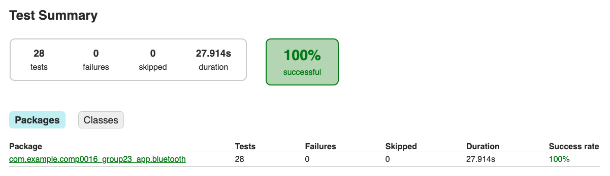

# Testing

---

## Testing Stratergy

MotionInput Bluetooth controller is a client-side application. This means we needed to formulate a comprehensive testing stratergy that would adequately cover all possible cases of user input through our UI. This meant we could ensure the apps usability meet our desired standards and that the app handles all cases of user input (good and bad) in a way that doesn't affect it's stability. Overall, this meant we could deliver an app that would be of a high standard.

### Testing Scope

1. MotionInput Bluetooth controller will be used with real people who will interact with the app using the UI, therefore, we must consider all possibilities of how of UI could be used. This means that the UI should not only be tested such that it correctly works with the internals of the app but that it also handles all forms of user input and deals with invalid input gracefully without causing any crashes.

2. The controller uses Bluetooth to connect to a range of devices therefore we should ensure to test compatibility with as many devices as possible.

3. The controller provides forms of control which should all be tested throughourly to ensure they work as designed.

4. Since the app is designed as being accessible to all, the accessibility of the app should be extensively tested.

### Automated and Manual Testing

Our testing stratergy followed the test-driven-development principle throughout the development process. We designed and wrote a combination of instrumented and integration tests that were focused on induvidual classes and small subsets of classes respectively and ensured the overall functionality remained as expected during development and any errors would be flagged immedietly. Simultaneously, we also fequently tested the app as a whole using test builds amoungst ourselves and test users to catch any other bugs. During this we made extensive use of GitHubs issues feature to track and document bugs as they were found and they aid in the process of resolving them. The full testing stratergy is summarised below:

<div class="img-center">

| Automated Tests           | Manual Tests              |
|---------------------------|---------------------------|
| Instrumented (Unit) Tests | User Acceptance Tests     |
| Integration Tests         | Compatability and Tests   |
| Performance Tests         |                           |

</div>

## Instrumented (Unit) Testing

We used instrumented testing on the majorirty of our classes such as fragments, activities, dialogs and bluetooth components due to their use of Android dependencies. This meant they could not be run on the standard JVM and be tested using standard unit tests. These instrumented tests are written in the same way as unit tests, and each test a small unit of the apps components. The tools we used for instrumented testing are Espresso, Mockito, UiAutomator, JUnit4 and AndroidX Fragment-Testing.

Instrumented tests in Android are a crucial part of the testing strategy for Android applications. These tests are designed to run on physical devices or emulators and simulate user interactions with the app. They are performed to ensure that app components function correctly in a real-world environment. Instrumented tests provide a higher level of confidence in the app's functionality, as they simulate real user interactions and validate the app's behavior against expected outcomes.

<div class="img-center">  </div>

AndroidX Fragment-Testing allowed us to launch and test fragments and activities in isolation to the full app. We then used Espresso to simulate user interactions and make assertions on UI components to test the UI and UiAutomator to interact with system-level UI elements such as permission requests. We combined this with Mockito to mock objects of our classes to simulate their behaviour, we could they insert them into our tests to simulate a variety of scenarios. Finally, we made use of JUnit to make assertions about the state of our objects during tests.

An example test which verifies that users cannot enter invalid MAC addresses is shown below:

```java title="/src/androidTest/java/com/example/comp0016_group23_app/fragments/bluetooth/AddManualFragmentTest.java"
public class AddManualFragmentTest {
    private FragmentScenario<AddManualFragment> scenario;
    @Mock
    private EventBus eventBus;

    @Before
    public void setUp() {
        scenario = FragmentScenario.launchInContainer(AddManualFragment.class, null, R.style.Theme_COMP0016Group23App);
        scenario.moveToState(Lifecycle.State.RESUMED);

        MockitoAnnotations.openMocks(this);
    }

    @After
    public void tearDown() {
        reset(eventBus);
    }

    @Ignore("Helper method to simulate button touch events")
    private void clickButtonWithId(int viewId) {
        scenario.onFragment(fragment -> {
            Button button = fragment.requireView().findViewById(viewId);

            MotionEvent downEvent = MotionEvent.obtain(0, 0, MotionEvent.ACTION_DOWN, button.getWidth() / 2f, button.getHeight() / 2f, 0);
            button.dispatchTouchEvent(downEvent);

            MotionEvent upEvent = MotionEvent.obtain(0, 0, MotionEvent.ACTION_UP, button.getWidth() / 2f, button.getHeight() / 2f, 0);
            button.dispatchTouchEvent(upEvent);
        });
    }

    @Test
    public void testInvalidMacError() {
        onView(withId(R.id.deviceMacInput)).perform(typeText("Not a valid MAC address"));
        clickButtonWithId(R.id.addDeviceButton);
        onView(withId(R.id.deviceMacInput)).check(matches(hasErrorText("Invalid MAC")));
    }
}
```

The results of these tests are as follows (*Note: The skipped tests are internal JUnit tests we do not need*):

<div class="img-center">  </div>

## Integration Testing

Integration tests were used to test how the bluetooth component interacted as a whole and with the Android framework. Alot of the same testing frameworks were used for this and we tried to simulate as much of the bluetooth functionality as possible to ensure eveything worked as intended. AndroidX allows us to launch an activity within our test class, we then created a blank TestActivity as to isolate the bluetooth component as much as possible so we could perform tests on it's functionality.

<div class="img-center">  </div>

## Testing Coverage

Our team utilised the Jacoco code coverage library to assess that 93% of our codebase is covered by our automated tests. Although, we had to exclude the MainActivity integration test class from our coverage report due to challenges with system-level permissions that cannot be modified during testing runtime. Despite this limitation, we're happy to achieve a high testing coverage, particularly considering the constraints imposed by the inability to test certain Android dependencies in our test suite.

<div class="img-center">  </div>

## Performace Testing

We tested our apps performance by measuring it's CPU usage and memory usage using the provided profiler by Android Studio. This allowed us to see the average overall performance of our app over a prolonged test but also gave us insight into how CPU and memory usage changed when we interacted with certain functions. This allowed us to identify any performance bottlenecks but also draw conclusions about the apps overall performance and usability.

The tests were carried out on a Samsung Galaxy XCover 5 with an Octa-Core processor @ 2GHz and 4GB of memory over a minute time period of general use. The resusts are given below:

<div class="img-center">  </div>

<br />

The results of the test show that CPU usage by the app remains consistiently within the range of 10%-15% throughout the test. We see no spikes in usage at any point during the test, even throughout usage of the apps UI elements, therefore it's reasonable to conclude the app it running efficiently without any obvoius processor bottlenecks.

<div class="img-center">  </div>

<br />

Memory usage is also consistient throughout the test, remaining in the range of 90MB-95MB. Similarly, we also see no spikes in usage, leading of to conclude there are no memory bottlenecks. From the total memory useage we see that approximetly 45MB comes from Java, Native and other sources outside of our apps code.

Finally, one important consideration when testing our apps performance is the hardware we used during testsing. For example, the Samesung XCover 5 that we used for testing throughout development is on the bottom end in terms of hardware performance for Samsung's devices. However, when testing the app on a Samsung S23, which in comparison has 8GB of memory and a 3.36GHz processor, we noticed the mouse movements on the target device were slightly smoother. Therefore, we note that the hardware the user installs the app on may have an impact on performance, but overall the app is still usable on all devices we testsed.

## Compatability and Hardware Testing

Throughout development we ensured to test on as many devices as possible. We have verified that our app can be connected to and control the following devices:

- Apple Mac Laptops and Computers
- Windows Laptops and Computers
- Apple iPad
- Android Tablets (e.g. Samsung Tablets)
- Android Smart TV (SONY Bravia)

We also conducted installation and testing of our app on a Chromebook due to its compatibility with Android apps. However, during these tests we found that Chromebooks (and ChromeOS) don't allow apps to access Bluetooth HID profiles and therefore our Bluetooth component would not be able to work. After communicating this problem with our client, Dean, he agreed that it would be best to drop support for Chromebook and focus on the mobile app.

The app itself can be installed and used on Android devices that are Bluetooth enabled and running Android version 11.0 and above. As of October 2023, according to statistics calculated by Google, this covers the majority of active android devices. Thefore we can conclude our app is deliverable and accessible to a large proportion of users. <sub>[1]</sub>

## User Acceptance Testing

### Testers

The testers include:

1. **Emily** - 18 year old student.
2. **James** - 21 year old student.
3. **Olivia** - 45 year old parent.
4. **Alex** - 39 year old producer.

***Note: These were all real-world testers, however, their identities have been made anonymous***

### Test Cases

We devised a set of test cases to be performed, followed by requesting feedback on a scale and any additional comments provided.

1. **Test Case 1:** We ask the user to find and pair to a new device, then connect to it.
2. **Test Case 2:** We asked the user to browse the web using the manual Mouse and Keyboard
3. **Test Case 3:** We asked the user to play Minecraft using the Gamepad
4. **Test Case 4:** We ask the user to play online games, including Subway Surfers and Cut the Rope, using MotionInput mode.

### Feedback from Users

<div class="img-center">

| Acceptance Requirement | Strongly Disagree | Disagree | Agree | Strongly Agree | Comments |
|--|--|--|--|--|--|
| Is the UI navigation easy | 0 | 0 | 0 | 4 | + The navigation bar makes it easy. |
| Was the user experience good | 0 | 0 | 0 | 4 | + The UI is intuitive and I could setup Bluetooth easily |
| Could you connect to a device | 0 | 0 | 0 | 4 | + Bluetooth scan and connection is easy to understand |
| Were you able to use the trackpad easily | 0 | 0 | 1 | 3 | - I struggled due to my limited movement |
| Did voice navigation work | 0 | 0 | 1 | 3 | + Was able to control the app using the set commands |
| Did you find the user guides useful | 0 | 0 | 2 | 2 | + They gice a good overview of the features |
| Could you play the games | 0 | 0 | 1 | 3 | - The sensitivity could be reduced |
| Was there any Bluetooth delay | 0 | 0 | 0 | 4 | + Mouse and Keyboard worked smoothly without lag |
| Were you able to use MotionInput | 0 | 0 | 0 | 4 | + Very easy to switch to MotionInput mode and works without any complicated setup |

</div>

### Conclusion

We were delighted by the feedback from users, indicating an overall positive experience. Their valuable input enabled us to pinpoint and rectify any sensitivity issues with mouse inputs effectively. Acting upon this feedback, we've implemented changes aimed at improving the user experience for all.

## References

[1] Composables, "Android Distribution Chart" *composable.com*, Oct. 1, 2023. [Online]. Available: https://www.composables.com/tools/distribution-chart [Accessed 15 March 2024] <br></br>