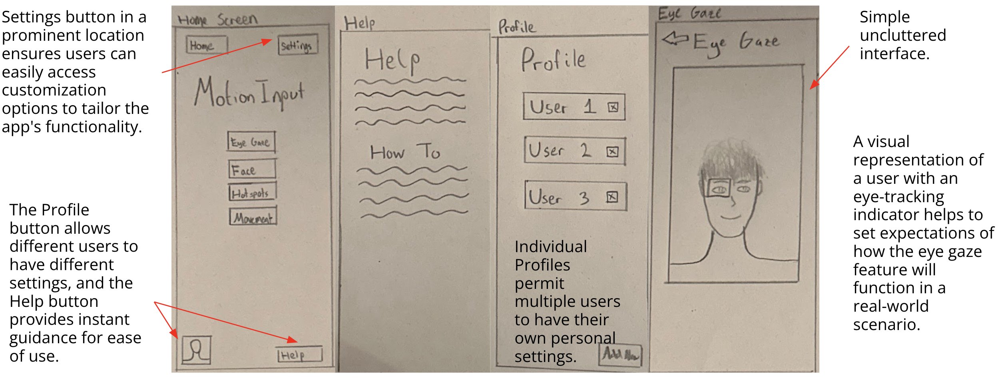

# Sketching Designs

We proceeded by sketching our initial ideas, drawing from the user requirements we gathered, the design considerations we outlined, and the personas and scenarios we created. Employing an iterative design approach, we developed each sketch based on the previous one, while incorporating necessary improvements along the way.

An example of an early stage sketch is shown below:

  

  

After several iterative stages, we evolved from the initial sketch to develop our design further:

  

  

  

  