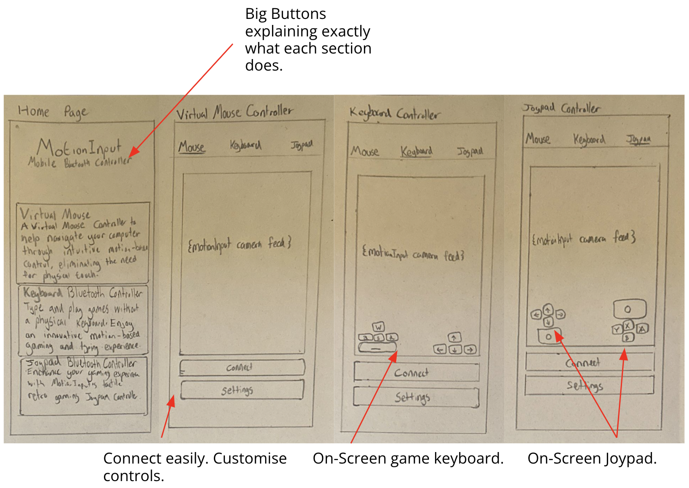
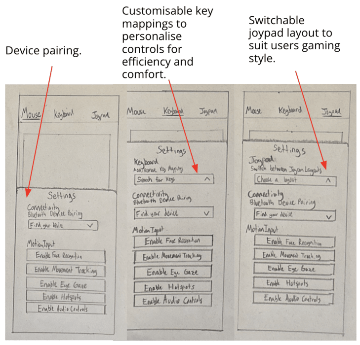

# UI Design

---

## Design Principles

To the best of our abilities, we designed our user interface with the following design principles in mind.

### Visibility

The design should ensure that all its features and actions are clearly visible and easily accessible to users. This means employing clear labeling for buttons and menu items, ensuring sufficient contrast between elements and backgrounds, and using intuitive visual cues to guide users' attention. Consistent placement of important features and controls throughout the app's interface also contributes to visibility, reducing the time users spend searching for functionality and enhancing their overall experience.

### Feedback

To provide effective feedback, the design should promptly respond to user actions and provide clear indications of their outcomes. This might include displaying success messages, error alerts, or progress indicators in response to user interactions. Visual cues such as animations, changes in color or loading screens can also communicate feedback effectively.

### Affordance

Each element inthe design should exhibit affordance, clearly indicating its intended function and how users can interact with it. Buttons should look clickable, interactive elements should respond to touch gestures, and draggable items should visually convey their manipulability. Employing familiar design patterns and adhering to platform conventions can help ensure that users instinctively understand how to interact with different elements within your app, reducing confusion and facilitating smooth navigation.

### Mapping

The design should establish a clear transition between user actions and their effects, making it easy for users to understand how to navigate the app. This involves ensuring that the relationship between controls and their respective outcomes is clear and intuitive. For example, if tapping on a button initiates a specific action, the result should be immediately visible or logically connected to that action.

### Consistiency

Maintaining consistency in design elements, terminology, layout, and interaction patterns is essential for ensuring a intuitive user experience. The design should follow established design guidelines and follow them throughout to provide users with a familiar environment. Consistency in visual styling, navigation flow, and interaction behaviors across different screens and sections of your app helps users feel comfortable and confident as they navigate and interact with its features.

### Constraints

 Implementing appropriate constraints in the design helps guide users towards desired actions and prevents them from making errors or encountering unintended outcomes. For example, removing irrelevant options or grayed-out buttons communicates to users that certain actions are not available in the current context. Providing clear error messages or confirmation prompts can also help users understand the limitations and requirements of specific actions, reducing frustration and imporving the overall usability of your app.

## Sketching Designs

We proceeded by sketching our initial ideas, drawing from the user requirements we gathered, the design considerations we outlined, and the personas and scenarios we created. Employing an iterative design approach, we developed each sketch based on the previous one, while incorporating necessary improvements along the way.

An example of an early stage sketch is shown below:

  

  

After several iterative stages, we evolved from the initial sketch to develop our design further:

  

  

  

  

## Final Wireframe

After sketching and reviewing our prototypes we selected a combination of the best UI components to piece together the final deisgn. We then used Figma to draw our final design as a wire-frame. This was the final step in the design pricess and was used as a low-level blueprint to help address any final usability issues and refine any final issues.

The final design uses an initial home-page which the app will load into on launch. This home-page contains a list of paired devices that the user can click to connect to that device as well as buttons to pair nex devices, either by scanning for nearby devices or adding manually. The user can then use the navigation bar to switch between app components. 

The mouse component uses a trackpad along with buttons, while the keyboard component repurposes the devices native keyboard for input. The Game Pad is a combination of mouse and keyboard inputs, using a joy-stick and buttons displayed on the screen. 

The final design can be seen in the interactive wire-frame below:

    <iframe width="450" height="885" src="https://www.figma.com/embed?embed_host=share&url=https%3A%2F%2Fwww.figma.com%2Fproto%2FBv8zm0SeGpPrsAKFTIN2QQ%2FUI-WireFrame%3Ftype%3Ddesign%26node-id%3D36-8337%26t%3DnUPZhBYCeKxlzgcw-1%26scaling%3Dmin-zoom%26page-id%3D0%253A1%26starting-point-node-id%3D36%253A8337%26mode%3Ddesign" allowfullscreen></iframe>

